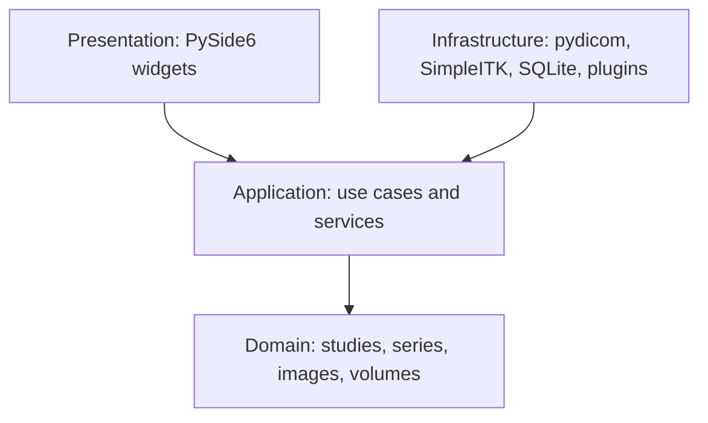

# Architecture

MedReport uses Clean Architecture to protect medical imaging workflows from UI and
infrastructure churn.

The presentation layer never manipulates DICOM files directly. It invokes application
services, which depend on repository protocols. Infrastructure adapters implement those
protocols with pydicom and SimpleITK.
